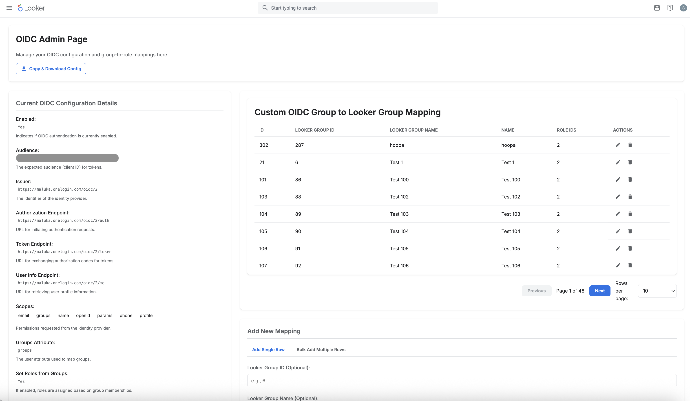
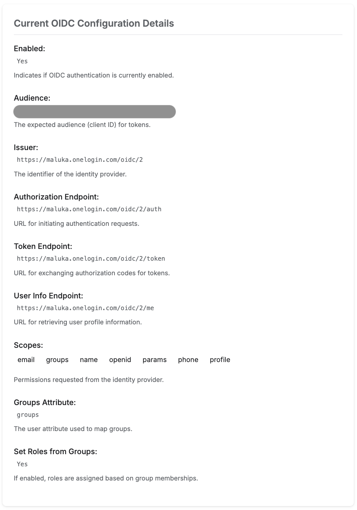

# OIDC Custom Group Manager

This is an extension for Looker designed to simplify the management of OpenID Connect (OIDC) custom groups directly within your Looker instance. It provides a user-friendly interface to configure and update your OIDC settings, streamlining the process of syncing user groups from your OIDC provider to Looker.

## Description

The OIDC Custom Group Manager extension allows Looker administrators to:

1.  **View OIDC Configuration:** Easily inspect the current OIDC setup within Looker
    <br />
   including a paginated performant view of existing mappings <br />
    <br />
   and export backups. <br />
   
3.  **Update OIDC Settings:** Modify OIDC configuration parameters, including custom group mappings. Individually
    <br />
   or in bulk <br />
    <br />
4.  **Streamlined Group Management:** Facilitate the synchronization of user groups from your OIDC provider to Looker, enabling granular access control.
5.  Confirmation dialogs to prevent unwanted actions
    <br />
   config tests run automatically before each update <br />
    <br />
   and error states capture any failed tests and aborted changes. <br />
    <br />

### Technologies Used

#### Frontend
- [React](https://reactjs.org/)
- [TypeScript](https://www.typescriptlang.org/)
- [Webpack](https://webpack.js.org/)

#### Looker
- [Looker Extension SDK](https://github.com/looker-open-source/sdk-codegen/tree/main/packages/extension-sdk-react)
- [Looker API](https://developers.looker.com/api/explorer/4.0/methods) (specifically `oidc_config` and `update_oidc_config`)

---

## Setup

This section outlines the steps to set up and deploy the OIDC Custom Group Manager extension for Looker.

### 1. Looker Extension Framework Setup

#### Getting Started for Local Development

1.  Clone or download a copy of this repository to your development machine.

    ```bash
    # cd ~/ Optional. your user directory is usually a good place to git clone to.
    git clone <YOUR_REPOSITORY_URL_HERE> oidc-custom-group-manager
    ```

2.  Navigate (`cd`) to the root directory in the cloned repo.

    ```bash
    cd oidc-custom-group-manager
    ```

3.  Install the dependencies with [NPM](https://docs.npmjs.com/downloading-and-installing-node-js-and-npm).

    ```bash
    npm install
    ```

    > You may need to update your Node version or use a [Node version manager](https://github.com/nvm-sh/nvm) to change your Node version.
    > If you get errors installing dependencies, you may try
    ```bash
    npm install --legacy-peer-deps
    ```

4.  Start the development server.

    ```bash
    npm run develop
    ```

    Great! Your extension is now running and serving the JavaScript at `https://localhost:3000/bundle.js`.

5.  Now log in to Looker and create a new project.

    This is found under **Develop** => **Manage LookML Projects** => **New LookML Project**.

    You'll want to select "Blank Project" as your "Starting Point". You'll now have a new project with no files.

    1.  In your copy of the extension project you have a `manifest.lkml` file.

        You can either drag & upload this file into your Looker project, or create a `manifest.lkml` with the same content.
        **NOTE:** The `url` in the manifest should point to your local development server for testing. For production, you will switch to `file`.

        ```lookml
        project_name: "admin-extensions"

        application: oidc-manager {
          label: "OIDC Manager"
          url: "https://localhost:3000"
          mount_points: {
            dashboard_vis: yes
            dashboard_tile: yes
            standalone: yes
          }
          entitlements: {
            use_downloads: yes
            local_storage: yes
            use_form_submit: no
            new_window: yes
            core_api_methods: ["oidc_config","update_oidc_config","create_oidc_test_config"]
            external_api_urls: ["http://localhost:5000","http://localhost:3000"]
          }
        }
        ```

6.  Create a `model` LookML file in your project. The name doesn't matter. The model and connection won't be used, and in the future this step may be eliminated.

    -   Add a connection in this model. It can be any connection, it doesn't matter which.
    -   [Configure the model you created](https://docs.looker.com/data-modeling/getting-started/create-projects#configuring_a_model) so that it has access to some connection.

7.  Connect your new project to Git. You can do this multiple ways:

    -   Create a new repository on GitHub or a similar service, and follow the instructions to [connect your project to Git](https://docs.looker.com/data-modeling/getting-started/setting-up-git-connection)
    -   A simpler but less powerful approach is to set up git with the "Bare" repository option which does not require connecting to an external Git Service.

8.  Commit your changes and deploy your them to production through the Project UI.

9. Reload the page and click the `Browse` dropdown menu. You should see your extension in the list.
    -   The extension will load the JavaScript from the `url` provided in the `application` definition. By default, this is `https://localhost:3000/bundle.js`. If you change the port your server runs on in the `package.json`, you will need to also update it in the `manifest.lkml`.

    - Refreshing the extension page will bring in any new code changes from the extension template, although some changes will hot reload.


#### Deployment

The process above requires your local development server to be running to load the extension code. To allow other people to use the extension, a production build of the extension needs to be run.

**Note:** A production-ready `bundle.js` is already included on our cdn `https://cdn.lkr.dev/apps/oidc-group-manager/latest/bundle.js`, so you generally don't need to build it yourself for deployment. To use the pre-built production file add this (`url: https://cdn.lkr.dev/apps/oidc-group-manager/latest/bundle.js`) in your `manifest.lkml` file and ensure that the `file` line is commented out

1.  If you want to build the extension yourself, run the command `npm run build` in your extension project directory on your development machine.
2.  Drag and drop the generated JavaScript file (`bundle.js`) contained in the `dist` directory into the Looker project interface.
3.  Modify your `manifest.lkml` to use `file` instead of `url` and point it at the `bundle.js` file.

    ```lookml
    project_name: "admin-extensions"

    application: oidc-manager {
      label: "OIDC Manager"
      file: "bundle.js"
      mount_points: {
        dashboard_vis: yes
        dashboard_tile: yes
        standalone: yes
      }
      entitlements: {
        use_downloads: yes
        local_storage: yes
        use_form_submit: no
        new_window: yes
        core_api_methods: ["oidc_config","update_oidc_config","create_oidc_test_config"]
        external_api_urls: ["http://localhost:5000","http://localhost:3000"]
      }
    }
    ```
